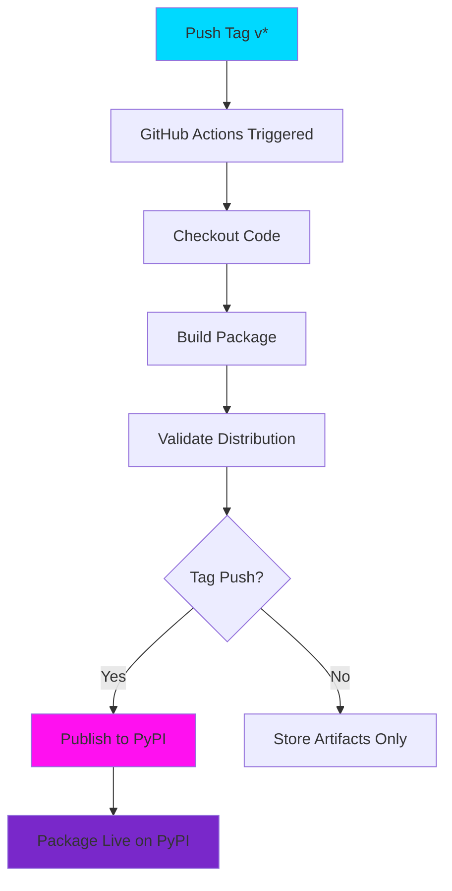

# GitHub & PyPI Automated Publishing Setup

## Overview

This guide sets up automated PyPI publishing using GitHub Actions and PyPI Trusted Publishers (no tokens needed!).


## Quick Start - One Command

```bash
./commit_and_publish.sh
```

This script will:
1. Validate all required files
2. Create GitHub repository (if needed)
3. Commit and push all files
4. Create version tag
5. Guide you through PyPI trusted publisher setup

## What's Included

### GitHub Actions Workflow

**File**: `.github/workflows/workflow.yml`

Triggers on:
- Tags starting with `v*` (e.g., `v1.0.0`)
- Manual trigger via GitHub UI

Actions performed:
1. Build package
2. Validate distribution
3. Publish to PyPI (using trusted publisher)

### Repository Configuration

- **Owner**: haKC-ai
- **Repository**: hakcer
- **URL**: https://github.com/haKC-ai/hakcer

## Setup Steps

### Step 1: Run Automated Script

```bash
./commit_and_publish.sh
```

The script will:
- Check all required files exist
- Initialize git repository
- Create GitHub repository
- Commit all files
- Push to GitHub
- Create version tag

### Step 2: Create GitHub Environment

The script will pause and ask you to:

1. Go to: https://github.com/haKC-ai/hakcer/settings/environments
2. Click **"New environment"**
3. Name it: `pypi`
4. **Recommended**: Add deployment protection rules
   - Require reviewers (optional but recommended)
   - Wait timer (optional)
5. Click **"Configure environment"**
6. Press Enter in the terminal to continue

### Step 3: Configure PyPI Trusted Publisher

The script will pause again and ask you to:

1. Go to: https://pypi.org/manage/account/publishing/
2. Click **"Add a new pending publisher"**
3. Fill in the form:
   - **PyPI Project Name**: `hakcer`
   - **Owner**: `haKC-ai` (note: should be `hakc-ai` based on your config, verify this!)
   - **Repository name**: `hakcer`
   - **Workflow name**: `workflow.yml`
   - **Environment name**: `pypi`
4. Click **"Add"**
5. Press Enter in the terminal to continue

## Publishing a Release

### Method 1: Push a Tag (Automated)

```bash
# Create and push a tag
git tag -a v1.0.0 -m "Release v1.0.0"
git push origin v1.0.0
```

This automatically triggers the workflow and publishes to PyPI.

### Method 2: Manual Trigger

Via GitHub CLI:
```bash
gh workflow run workflow.yml
```

Via GitHub UI:
1. Go to: https://github.com/haKC-ai/hakcer/actions
2. Select "Publish to PyPI" workflow
3. Click "Run workflow"
4. Select branch: `main`
5. Click "Run workflow"

## Workflow Diagram



## Monitoring Deployments

### GitHub Actions

View workflow runs:
```bash
gh run list --workflow=workflow.yml
```

Or visit: https://github.com/haKC-ai/hakcer/actions

### PyPI

After first successful publish:
- Package page: https://pypi.org/project/hakcer/
- Stats: https://pypistats.org/packages/hakcer

## Troubleshooting

### "Repository not found"

Make sure repository exists:
```bash
gh repo view haKC-ai/hakcer
```

If not, create it:
```bash
gh repo create haKC-ai/hakcer --public --description "Animated ASCII banner with terminal effects"
```

### "Workflow failed: OIDC token verification failed"

1. Check PyPI trusted publisher configuration
2. Verify Owner is exactly: `haKC-ai` (or `hakc-ai` - check which format PyPI requires)
3. Verify Repository is exactly: `hakcer`
4. Verify Workflow name is exactly: `workflow.yml`
5. Verify Environment name is exactly: `pypi`

### "Environment not found"

Create the environment:
1. Go to: https://github.com/haKC-ai/hakcer/settings/environments
2. Click "New environment"
3. Name: `pypi`
4. Save

### "Workflow file not found"

Verify the file exists:
```bash
gh api repos/haKC-ai/hakcer/contents/.github/workflows/workflow.yml
```

If missing, commit it:
```bash
git add .github/workflows/workflow.yml
git commit -m "Add publishing workflow"
git push
```

## Files Committed to GitHub

The script commits these files:

**Core Package:**
- `hakcer/__init__.py`
- `hakcer/banner.py`
- `hakcer/themes.py`

**Configuration:**
- `setup.py`
- `pyproject.toml`
- `requirements.txt`
- `MANIFEST.in`

**Documentation:**
- `README.md`
- `LICENSE`
- `CHANGELOG.md`
- `CONTRIBUTING.md`
- (and other .md files)

**Tools:**
- `examples.py`
- `test_package.py`

**CI/CD:**
- `.github/workflows/workflow.yml`
- `.github/workflows/publish.yml`
- `.gitignore`

**Excluded** (via .gitignore):
- `do_not_commit/` directory
- `build/`, `dist/`, `*.egg-info`
- `__pycache__/`, `*.pyc`

## Version Management

### Releasing New Versions

1. **Update version** in three places:
   - `hakcer/__init__.py`: `__version__ = "1.0.1"`
   - `setup.py`: `version="1.0.1"`
   - `pyproject.toml`: `version = "1.0.1"`

2. **Update CHANGELOG.md**

3. **Commit changes**:
   ```bash
   git add .
   git commit -m "Bump version to 1.0.1"
   git push
   ```

4. **Create and push tag**:
   ```bash
   git tag -a v1.0.1 -m "Release v1.0.1"
   git push origin v1.0.1
   ```

5. **Workflow runs automatically** and publishes to PyPI

## Security Benefits of Trusted Publishers

### Why This is Better Than API Tokens

**Traditional Method (API Tokens):**
- Token can be stolen from GitHub Secrets
- Token has long-lived access
- If compromised, attacker can publish malicious packages
- Need to rotate tokens periodically

**Trusted Publishers (This Setup):**
- No tokens stored anywhere
- Uses OpenID Connect (OIDC) for temporary authentication
- Only your specific GitHub workflow can publish
- Automatically rotates credentials
- Can't be stolen or leaked
- More secure and recommended by PyPI

## Post-Setup Checklist

After running `./commit_and_publish.sh`:

- [ ] GitHub repository created and accessible
- [ ] All files committed and pushed
- [ ] Version tag created (v1.0.0)
- [ ] GitHub environment 'pypi' created
- [ ] PyPI trusted publisher configured
- [ ] Workflow file exists on GitHub
- [ ] Test the workflow by pushing a tag

## Support

- **GitHub**: https://github.com/haKC-ai/hakcer
- **Issues**: https://github.com/haKC-ai/hakcer/issues
- **PyPI**: https://pypi.org/project/hakcer/ (after first publish)
- **Email**: cory@haKC.ai

---

**Run `./commit_and_publish.sh` to get started!**
