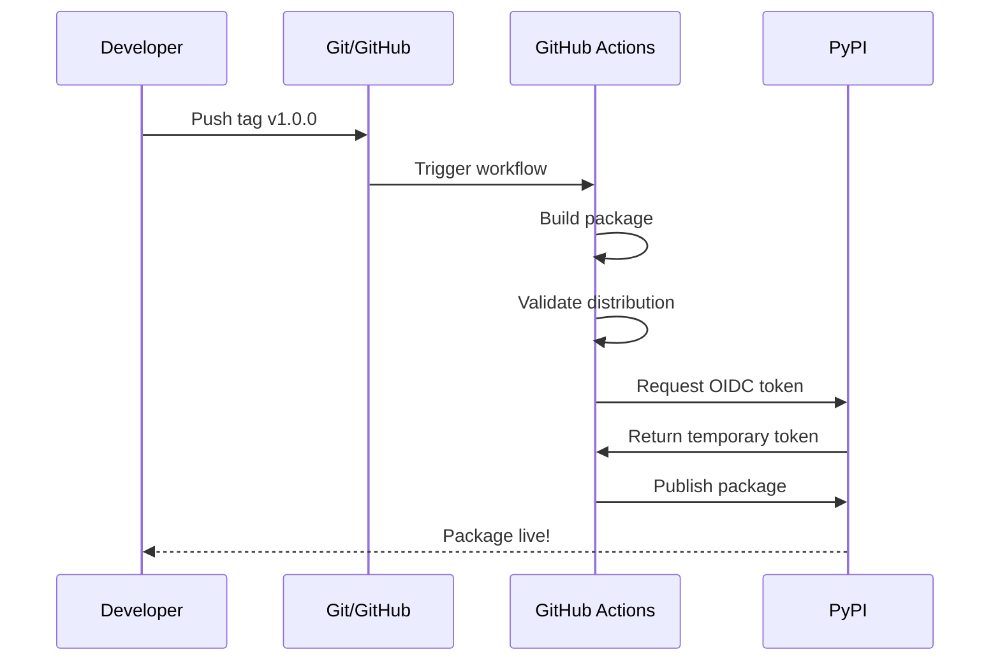

# Publish haKCer to PyPI - Quick Guide

## TL;DR - One Command

```bash
./commit_and_publish.sh
```

Then follow the prompts to complete 2 manual steps on web UI.

---

## What This Does


---

## The Process

### Step 1: Run the Script

```bash
cd "/Users/0xdeadbeef/Downloads/files (7)"
./commit_and_publish.sh
```

**What it does automatically:**
- Validates all required files exist
- Creates GitHub repository: `haKC-ai/hakcer`
- Commits all files (excluding `do_not_commit/`)
- Pushes to GitHub
- Creates version tag `v1.0.0`

### Step 2: Create GitHub Environment (Manual)

**The script will pause and show:**

```
Go to: https://github.com/haKC-ai/hakcer/settings/environments
```

**What to do:**
1. Click **"New environment"**
2. Name: `pypi`
3. (Optional) Add deployment protection rules
4. Click **"Configure environment"**
5. Go back to terminal and press **Enter**

### Step 3: Configure PyPI Trusted Publisher (Manual)

**The script will pause again and show:**

```
Go to: https://pypi.org/manage/account/publishing/
```

**What to do:**
1. Click **"Add a new pending publisher"**
2. Fill in:
   - **PyPI Project Name**: `hakcer`
   - **Owner**: `hakc-ai`
   - **Repository name**: `hakcer`
   - **Workflow name**: `workflow.yml`
   - **Environment name**: `pypi`
3. Click **"Add"**
4. Go back to terminal and press **Enter**

### Step 4: Done!

Script completes and shows summary.

---

## After Setup - How to Publish

### Automatic Publishing (Recommended)

Every time you push a tag starting with `v`, it publishes automatically:

```bash
# Make some changes
git add .
git commit -m "Add new feature"
git push

# Create and push version tag
git tag -a v1.0.1 -m "Release v1.0.1"
git push origin v1.0.1
```

GitHub Actions will automatically:
1. Build the package
2. Validate it
3. Publish to PyPI

### Manual Trigger

Via GitHub UI:
1. Go to https://github.com/haKC-ai/hakcer/actions
2. Click "Publish to PyPI"
3. Click "Run workflow"

Via CLI:
```bash
gh workflow run workflow.yml
```

---

## Monitoring

### Watch the Workflow

```bash
gh run watch
```

Or visit: https://github.com/haKC-ai/hakcer/actions

### Check PyPI

After first successful publish:
https://pypi.org/project/hakcer/

---

## Publishing Flow Diagram



---

## Files That Will Be Committed

**Included in GitHub repo:**
- All Python package files (`hakcer/`)
- Configuration files (`setup.py`, `pyproject.toml`, etc.)
- Documentation (`README.md`, etc.)
- Workflow (`.github/workflows/workflow.yml`)
- Examples and tests

**Excluded** (via `.gitignore`):
- `do_not_commit/` - Your reference files
- `build/`, `dist/` - Build artifacts
- `*.egg-info` - Package metadata
- `__pycache__/` - Python cache

---

## Why Trusted Publishers?

### Traditional Way (Not Recommended)
- Store PyPI token in GitHub Secrets
- Token can be stolen
- Long-lived credentials
- Manual rotation needed

### Trusted Publishers (This Setup)
- No tokens stored anywhere
- Uses temporary OIDC tokens
- Automatically rotates
- More secure
- Recommended by PyPI

---

## Quick Reference

| Action | Command |
|--------|---------|
| **Setup everything** | `./commit_and_publish.sh` |
| **Check workflow status** | `gh run list` |
| **Watch workflow** | `gh run watch` |
| **Manual trigger** | `gh workflow run workflow.yml` |
| **View repo** | `gh repo view haKC-ai/hakcer --web` |
| **View actions** | Open https://github.com/haKC-ai/hakcer/actions |
| **View PyPI** | Open https://pypi.org/project/hakcer/ |

---

## Troubleshooting

### Script fails at "gh not found"

Install GitHub CLI:
```bash
brew install gh
```

### Script fails at "not authenticated"

Authenticate:
```bash
gh auth login
```

### Workflow fails at publish step

Check:
1. GitHub environment `pypi` exists
2. PyPI trusted publisher configured correctly
3. Owner is exactly: `hakc-ai` (lowercase, no dash)
4. Workflow name is exactly: `workflow.yml`

---

## Ready? Let's Go!

```bash
./commit_and_publish.sh
```

Follow the prompts, complete the 2 manual steps, and you're live on PyPI!

---

**Questions?** See [GITHUB_PYPI_SETUP.md](GITHUB_PYPI_SETUP.md) for detailed guide.
