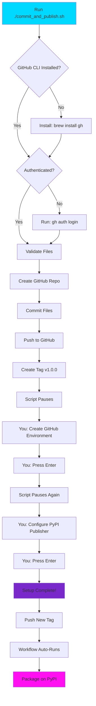

# RUN THIS NOW - Complete Setup

## ONE COMMAND TO RULE THEM ALL

```bash
./commit_and_publish.sh
```

## What Happens


### Automated Steps (Script Does This)

1. **Validates Files** - Checks all required files exist
2. **Creates GitHub Repo** - Creates `haKC-ai/hakcer`
3. **Commits Everything** - Commits all package files
4. **Pushes to GitHub** - Uploads to `main` branch
5. **Creates Tag** - Tags as `v1.0.0`

### Manual Steps (You Do This)

**Step A: Create GitHub Environment**

When script pauses:
- Go to shown URL
- Create environment named `pypi`
- Press Enter

**Step B: Configure PyPI**

When script pauses again:
- Go to PyPI publisher page
- Add pending publisher with shown details
- Press Enter

## The Exact Commands

```bash
# Navigate to directory
cd "/Users/0xdeadbeef/Downloads/files (7)"

# Run the script
./commit_and_publish.sh
```

Then follow prompts.

## What Gets Published

### To GitHub: `haKC-ai/hakcer`

**Committed files:**
```
hakcer/
  __init__.py
  banner.py
  themes.py
setup.py
pyproject.toml
README.md
LICENSE
requirements.txt
MANIFEST.in
.gitignore
.github/workflows/workflow.yml
examples.py
test_package.py
CHANGELOG.md
CONTRIBUTING.md
(and other documentation)
```

**NOT committed** (ignored):
```
do_not_commit/         <- Your reference files
build/                 <- Build artifacts
dist/                  <- Distribution files
*.egg-info            <- Package metadata
__pycache__/          <- Python cache
```

### To PyPI: `hakcer`

**After first tag push**, automatically published:
- Package name: `hakcer`
- Version: `1.0.0`
- Install: `pip install hakcer`

## After Script Completes

### Test the Publishing

```bash
# Update version (optional, for testing)
# Edit: hakcer/__init__.py, setup.py, pyproject.toml
# Change 1.0.0 to 1.0.1

# Commit
git add .
git commit -m "Test release"

# Push tag
git tag -a v1.0.1 -m "Test release"
git push origin v1.0.1
```

### Watch It Work

```bash
# Via CLI
gh run watch

# Or visit
open https://github.com/haKC-ai/hakcer/actions
```

### Verify on PyPI

After workflow completes:
```bash
open https://pypi.org/project/hakcer/
```

## Your PyPI Configuration

Based on your provided info:

| Setting | Value |
|---------|-------|
| **PyPI Project Name** | `hakcer` |
| **Owner** | `hakc-ai` |
| **Repository name** | `hakcer` |
| **Workflow name** | `workflow.yml` |
| **Environment name** | `pypi` |

These MUST match exactly in PyPI trusted publisher setup!

## Verification Checklist

After running script:

- [ ] GitHub repository created: https://github.com/haKC-ai/hakcer
- [ ] All files committed and visible on GitHub
- [ ] Tag `v1.0.0` exists
- [ ] Workflow file exists: `.github/workflows/workflow.yml`
- [ ] GitHub environment `pypi` created
- [ ] PyPI trusted publisher configured
- [ ] Test tag pushed and workflow ran
- [ ] Package appears on PyPI

## Quick Commands

```bash
# Run setup
./commit_and_publish.sh

# After setup, verify repo
gh repo view haKC-ai/hakcer --web

# Check workflows
gh run list

# View latest run
gh run view

# Watch active run
gh run watch

# Manual publish trigger
gh workflow run workflow.yml
```

## The Full Flow



## Files Summary

| Category | Count | Examples |
|----------|-------|----------|
| **Python Package** | 3 | `hakcer/*.py` |
| **Config** | 4 | `setup.py`, `pyproject.toml` |
| **Documentation** | 10+ | `README.md`, `CONTRIBUTING.md` |
| **Tools** | 5+ | `examples.py`, `deploy.sh` |
| **CI/CD** | 2 | `.github/workflows/*.yml` |
| **Excluded** | Many | `do_not_commit/`, `build/` |

## Support

- **Script Issues**: Check `GITHUB_PYPI_SETUP.md`
- **Workflow Issues**: Check GitHub Actions logs
- **PyPI Issues**: Check PyPI dashboard
- **Email**: cory@haKC.ai

---

## READY? RUN IT!

```bash
./commit_and_publish.sh
```

**That's it!** The script will guide you through everything else.

---


